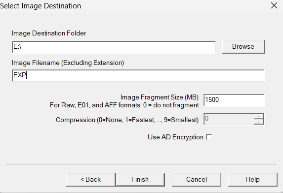
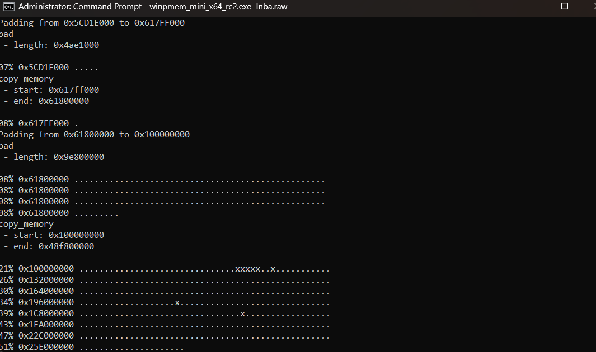
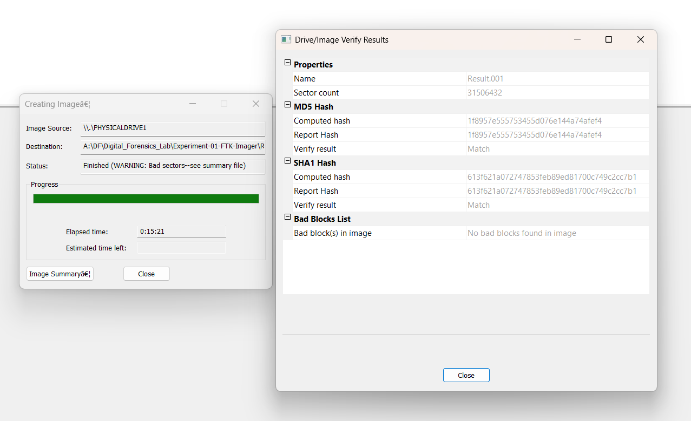
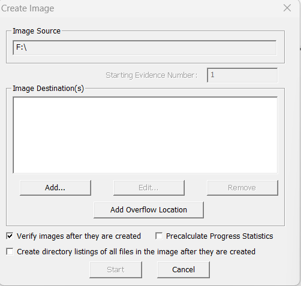

# Ex. No 1: Evidence Acquisition Using AccessData FTK Imager

**Course / Lab:** Digital Forensics Laboratory  
**Experiment:** Evidence Acquisition Using AccessData FTK Imager[cite: 2]  
**Candidate Name:** Sanjeevi Kumar S  
**Date:** August 27, 2026  

---

## 📋 Overview
Forensic Toolkit (FTK) Imager is an industry-standard computer forensics software product used for acquiring and analyzing digital evidence securely[cite: 2]. This experiment demonstrates the methodology for acquiring both volatile memory (RAM) and non-volatile storage (logical partitions) while preserving evidence integrity through cryptographic hashing.

---

## 🛠️ Experiment Objectives
1. Capture volatile memory and system states from a live environment.
2. Acquire non-volatile evidence via logical drive/partition imaging to optimize laboratory time[cite: 3].
3. Verify data integrity by computing and validating MD5 and SHA1 checksums[cite: 3].

---

## Part 1: Acquiring Volatile Memory (RAM)

Volatile memory captures running processes, active network sockets, and temporary data.

### Steps:
1. Launch the memory acquisition utility (e.g., WinPmem/FTK memory capture module) with administrator privileges[cite: 3].
2. Define the output destination file (`.raw` / `.mem`) and monitor the live memory dumping progress[cite: 3].
3. Allow the driver to complete the memory transfer and verify driver unloading.

| Capturing Memory in Progress | Memory Capture Completed |
| :---: | :---: |
|  |  |
| *Figure 1.1: Live memory dumping execution.* | *Figure 1.2: Successful memory dump completion.* |

---

## Part 2: Acquiring Non-Volatile Memory (Logical Drive / Partition)

To streamline forensic acquisition workflows, a specific partition (`F:\`) is targeted instead of the entire physical disk.

### Steps:
1. Open FTK Imager and initiate the **Create Disk Image** wizard[cite: 3].
2. Select **Logical Drive** as the source type and choose the target partition (`F:\`)[cite: 3].
3. Fill in the **Evidence Item Information** (Case Number, Evidence Number, Unique Description, Examiner, and Notes)[cite: 3].
4. Configure the destination folder (`E:\`), image filename (`EXP`), fragment size, and enable **Verify images after they are created**[cite: 3].
5. Click **Start** to begin imaging[cite: 3].

| Evidence Item Information | Image Source & Destination Setup | Configuring Destination & Fragment Size |
| :---: | :---: | :---: |
|  |  |  |
| *Figure 2.1: Case and examiner metadata.* | *Figure 2.2: Source partition selection (`F:\`).* | *Figure 2.3: Destination path and options.* |

---

## 🔍 Verification & Cryptographic Hashes

To ensure court admissibility and data integrity, FTK Imager automatically calculates cryptographic hashes upon completion and cross-verifies them against the report hash[cite: 3].

| Verification Result |
| :---: |
|  |
| *Figure 3.1: Drive/Image Verify Results showing successful MD5 and SHA1 matches.* |

### Checksum Summary:
```text
Image Type: Raw / Logical Drive Image (Result.001)
Sector Count: 31506432

[MD5 Hash]
Computed hash:    1f8957e55573455d076e144a74afef4
Report hash:      1f8957e55573455d076e144a74afef4
Verify result:    Match

[SHA1 Hash]
Computed hash:    613f621a072747853feb89ed81700c749c2cc7b1
Report hash:      613f621a072747853feb89ed81700c749c2cc7b1
Verify result:    Match

[Bad Blocks List]
Bad block(s) in image: No bad blocks found in image
