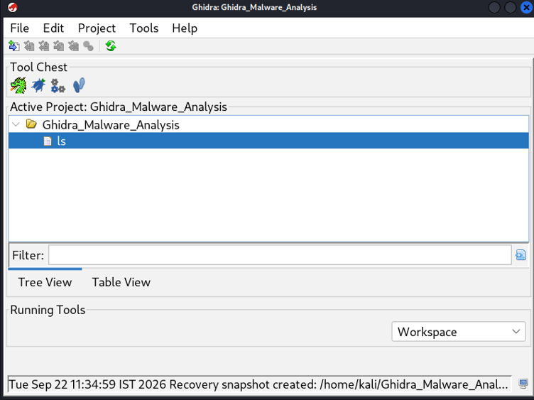
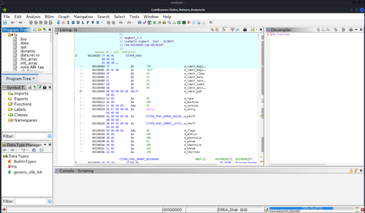
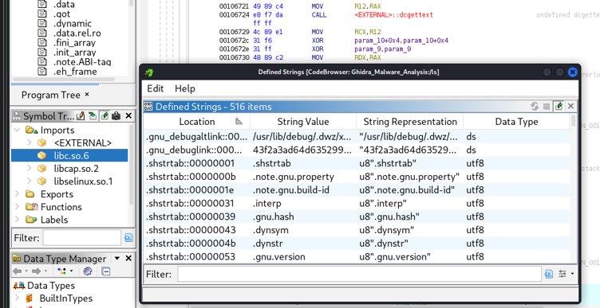
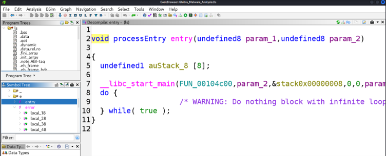
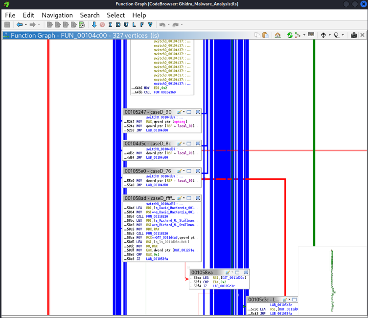

# Ex. No 10: Malware Disassembly and Analysis Using Ghidra

**Course / Lab:** Digital Forensics Laboratory  
**Experiment:** Malware Disassembly and Analysis Using Ghidra  
**Candidate Name:** Sanjeevi Kumar S  
**Date:** September 22, 2026  

---

## 📋 Overview
Ghidra is a free, open-source software reverse engineering (SRE) framework developed by the National Security Agency (NSA). It provides a comprehensive suite of tools for analyzing compiled code across multiple platforms and architectures, including x86, ARM, MIPS, and more. In digital forensics, Ghidra is used to disassemble malware binaries, decompile machine code into readable C-like pseudocode, analyze control flow graphs, and identify malicious functionalities such as persistence mechanisms, encryption routines, anti-debugging techniques, and network communication patterns.

---

## 🛠️ Experiment Objectives
1. Set up a Ghidra project and import a suspect binary for analysis.
2. Perform auto-analysis to identify functions, strings, and cross-references.
3. Use the Disassembly Listing and Decompiler views to understand program behavior.
4. Identify indicators of malicious functionality (anti-debugging, suspicious API calls, encoded strings).

---

## 🖥️ Software and Tools Required
- **Ghidra** (v10.x or later) — Downloaded from [ghidra-sre.org](https://ghidra-sre.org)
- **Java Development Kit (JDK 17+)** — Required runtime for Ghidra
- A sample binary executable (controlled/benign sample for lab purposes)
- **Isolated virtual machine** — Critical for safe malware analysis

---

## ⚠️ Safety Precaution
> All malware analysis must be performed within an **isolated virtual machine** with no network access to the host system. Never execute suspected malware on a production machine.

---

## Step 1: Create Project and Import Binary

1. Launch Ghidra and create a new **Non-Shared Project** (e.g., `MalwareAnalysis_Case001`).
2. Use **File → Import File** to load the suspect binary.
3. Ghidra auto-detects the file format (e.g., **Portable Executable (PE)**), architecture (**x86:LE:32:default**), and compiler.
4. Accept the import summary and proceed to the **CodeBrowser** for analysis.

---

## Step 2: Auto-Analysis and Code Browser

Upon opening the binary in the CodeBrowser, Ghidra performs comprehensive auto-analysis:

- **Function identification** — Locates and labels all function entry points
- **Cross-referencing (XREF)** — Maps all call sites and data references
- **String extraction** — Identifies embedded strings (URLs, file paths, registry keys)
- **Import/export resolution** — Maps Windows API calls to known library functions

The CodeBrowser interface is divided into three primary panels:

| Panel | Purpose |
| :--- | :--- |
| **Program Tree / Symbol Tree** (Left) | Navigate the binary's sections (`.text`, `.data`, `.rdata`) and browse all identified functions |
| **Listing (Disassembly)** (Center) | View x86 assembly instructions with addresses, opcodes, and cross-references |
| **Decompiler** (Right) | View auto-generated C-like pseudocode for the selected function |


---

## Step 3: Function Analysis — Identifying Malicious Behavior

### Key Analysis Techniques:

**1. String Analysis**
Navigate to **Window → Defined Strings** to extract all embedded strings. Look for:
- URLs and IP addresses (C2 communication)
- File paths (`C:\Windows\`, `\AppData\`)
- Registry keys (`HKLM\SOFTWARE\Microsoft\Windows\CurrentVersion\Run`)
- Encoded/obfuscated strings (Base64, XOR patterns)

**2. Import Table Analysis**
Review the binary's imported Windows API functions via **Window → Symbol Table**:

| Suspicious API | Potential Purpose |
| :--- | :--- |
| `CreateRemoteThread` | Process injection |
| `VirtualAllocEx` | Remote memory allocation |
| `WriteProcessMemory` | Code injection into another process |
| `InternetOpenUrl` | HTTP communication (C2) |
| `RegSetValueEx` | Registry modification (persistence) |
| `CryptEncrypt` | Data encryption (ransomware) |
| `IsDebuggerPresent` | Anti-debugging evasion |

**3. Control Flow Graph Analysis**
Use **Window → Function Graph** to visualize the execution flow of suspicious functions. Branch conditions, loops, and conditional jumps reveal the program's decision-making logic.

---

## Step 4: Decompiler Analysis

The Ghidra Decompiler automatically converts assembly code into readable C-like pseudocode:

```c
undefined4 __cdecl main(int argc, char **argv) {
    int iVar1;
    void *pvoid1;
    
    iVar1 = sub_401000();        // Anti-debugging check
    if (iVar1 == -0x21524111) {  // Magic value comparison
        pvoid1 = (void *)malicious_routine();  // Payload execution
    } else {
        iVar1 = iVar1 + 1;
        _printf("%d\n", iVar1);  // Benign decoy output
    }
    return 0;
}
```

This decompiled output reveals:
- A function call to `sub_401000()` performing an anti-debugging check
- A magic value comparison (`0xdeadbeef`) used as an anti-analysis trigger
- Conditional branching that executes `malicious_routine()` only when the check passes
- A benign decoy path (`printf`) to mislead static analysis

---

## Step 5: Documenting Findings

### Report Template Structure:

```
├── Summary of Analysis
│   └── Binary type, architecture, compiler, file size, hashes
├── Function Analysis
│   └── Key functions identified, their purpose, call graph
├── Behavioral Indicators
│   ├── Persistence mechanisms
│   ├── Anti-analysis techniques
│   ├── Network communications
│   └── File system / registry modifications
└── Recommendations
    └── Containment, eradication, YARA rules, IOCs
```

---

## ✅ Result
The suspect binary was successfully disassembled and analyzed using Ghidra. The auto-analysis identified critical functions, and the Decompiler revealed C-like pseudocode exposing anti-debugging checks (magic value `0xdeadbeef`), conditional execution of a malicious payload, and decoy benign behavior. Suspicious API imports (process injection, registry manipulation, network communication) were catalogued as Indicators of Compromise (IOCs). The analysis demonstrates Ghidra's effectiveness as a primary tool for static malware analysis in digital forensic investigations.

---

## ??? Execution Screenshots

| Image | Image |
| :---: | :---: |
|  |  |
|  |  |
|  | |
