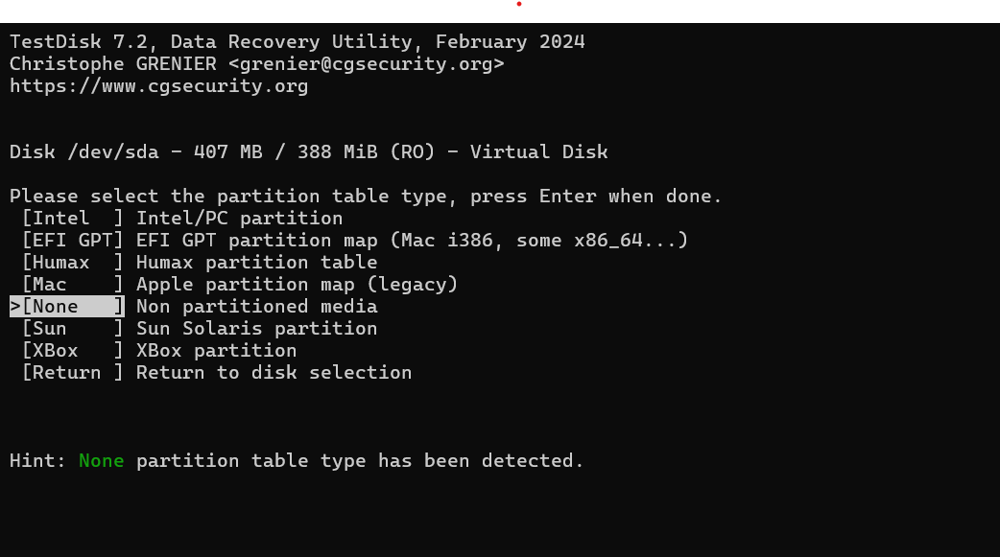
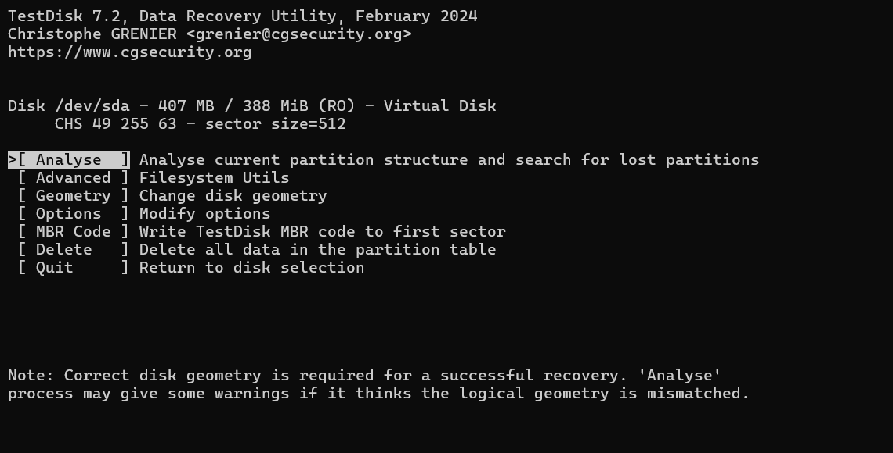
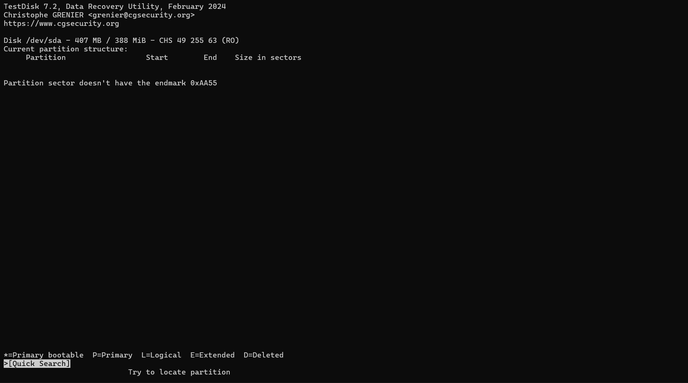
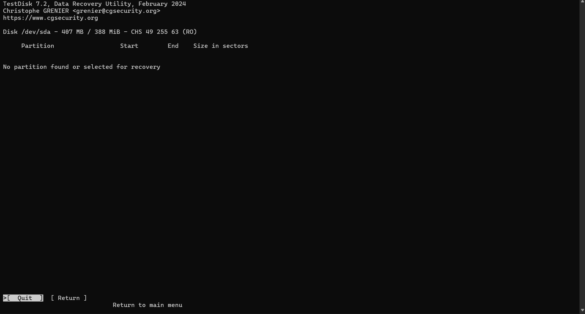

# Virtual Disk Image Analysis & Troubleshooting

When testing the Aegis-OS system images using QEMU, it is occasionally necessary to inspect the raw virtual disk to verify structural integrity, particularly if the bootloader fails to execute properly. We utilize **TestDisk** to analyze the partition structure and verify boot sector signatures.

## Diagnosing Boot Sector Errors 

If the system image fails to boot or is unrecognized, follow these steps to analyze the disk structure:

### 1. Select Partition Table Type
Launch TestDisk and select the virtual disk (`/dev/sda` in this environment). Because the image is being built from scratch and may not yet have a standard partition table written to it, select **[None] Non partitioned media**.

*Selecting the appropriate media type for the raw virtual disk.*

### 2. Initiate Disk Analysis
From the disk menu, select **[ Analyse ]** to scan the current partition structure and search for any lost or misaligned partitions. Correct disk geometry is critical here, but TestDisk will handle standard 512-byte sector sizes for the virtual image.

*Initiating the analysis process on the 407 MB virtual disk.*

### 3. Missing Boot Signature (0xAA55)
During the creation of the bootloader, ensuring standard compatibility (like the Multiboot 1 header) is crucial. A common error during early development is the absence of the Master Boot Record (MBR) boot signature. If TestDisk returns the error `Partition sector doesn't have the endmark 0xAA55`, the binary is missing the standard `55 AA` magic number at the end of the boot sector (byte 510 and 511).

*TestDisk successfully identifying the missing 0xAA55 boot signature.*

### 4. Search Results & Resolution
If a Quick Search yields **No partition found or selected for recovery**, it confirms the image is entirely raw or the partition table is entirely unwritten. 

*Final result indicating no recoverable standard partitions.*

**Next Steps:**
*   Verify the linker script to ensure the bootloader header and signature are placed at the correct memory offset.
*   Recompile the system image to include the necessary `0xAA55` endmark before the next QEMU test run.
 
