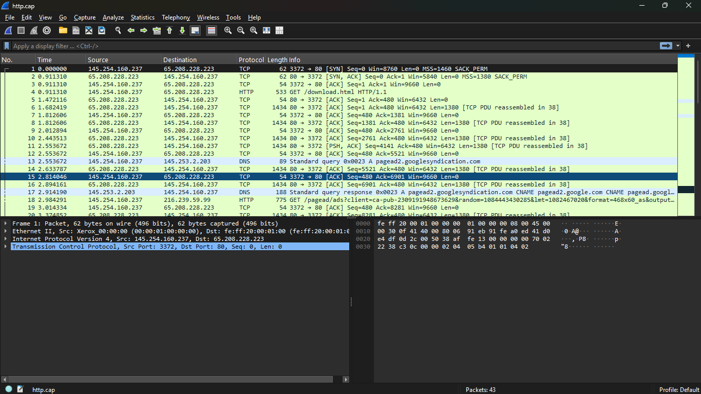
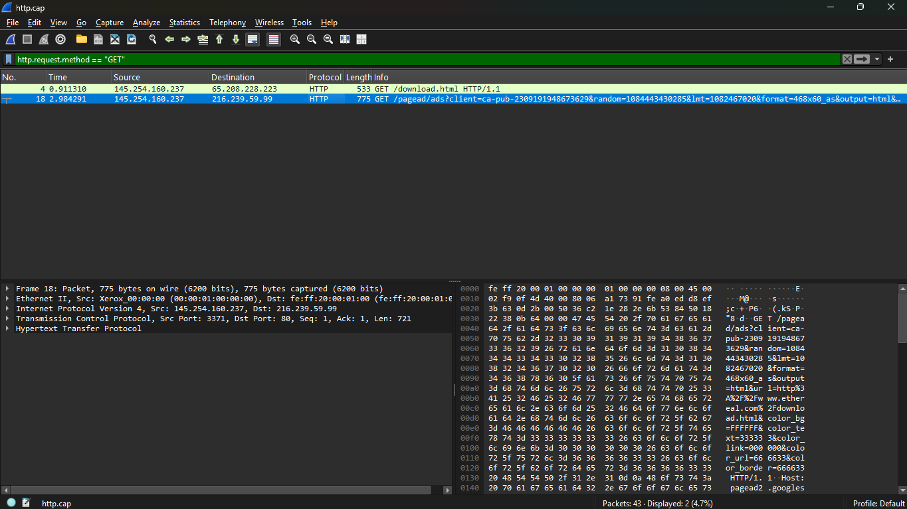
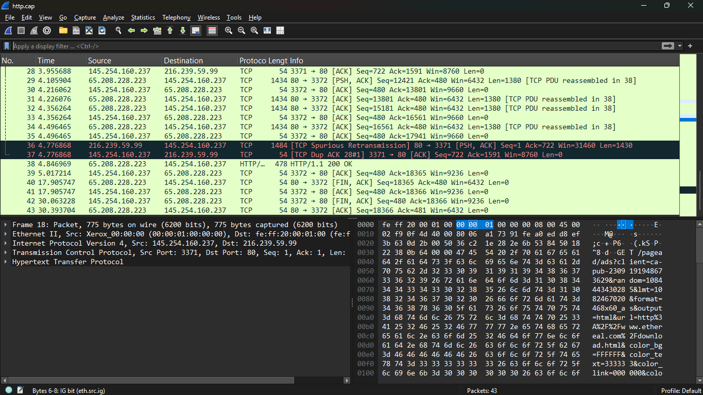
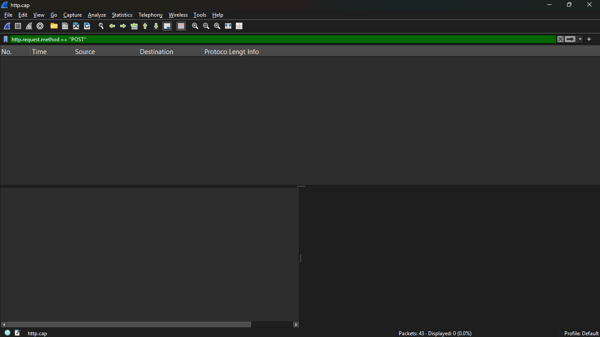
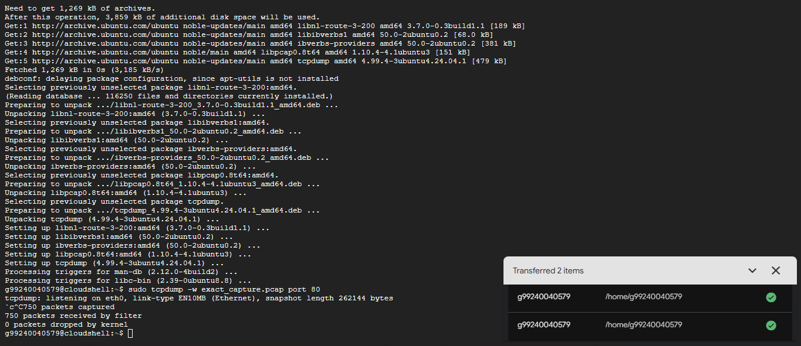
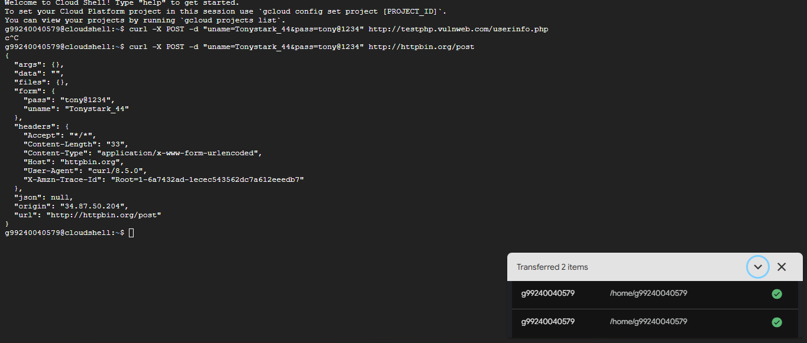
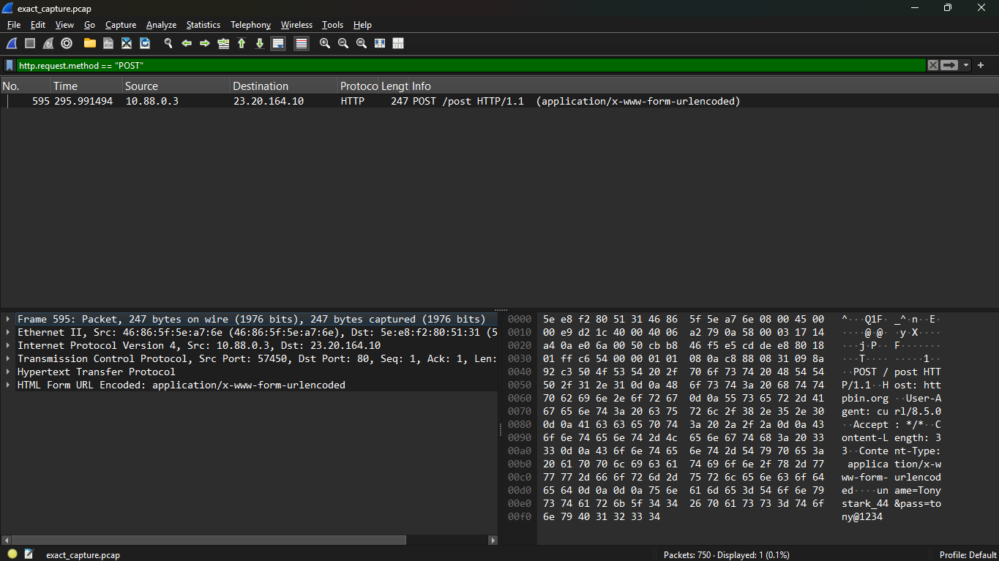
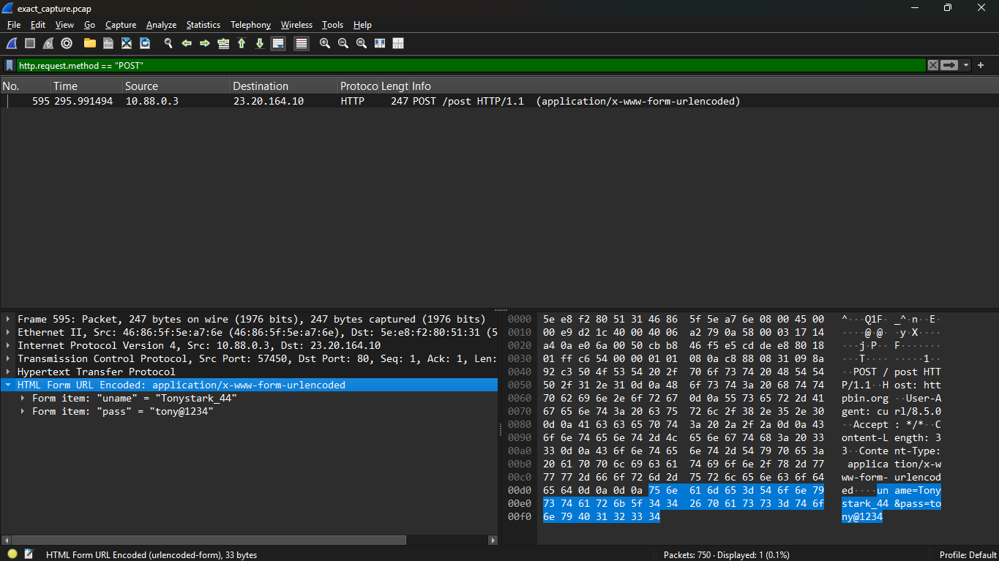

# Experiment 3: Digital Forensics - Network Analysis with Wireshark and tcpdump

This experiment focuses on capturing and analyzing network traffic within the Google Cloud Shell environment using command-line tools and Wireshark.

## Execution Steps

### 1. Initial Packet Capture 
Opening the initial `.cap` file reveals the raw network traffic, including standard TCP handshakes and HTTP connections.

### 2. Filtering for HTTP GET Requests
Applying the display filter `http.request.method == "GET"` allows us to isolate specific web page requests and analyze the destination IPs.

### 3. Analyzing TCP Errors
By inspecting the packet stream, we can identify TCP anomalies such as Spurious Retransmissions and Duplicate ACKs, which are useful for diagnosing network health.

### 4. General Traffic Analysis
Further analysis of the captured packets to understand the overall network flow.

### 5. Executing tcpdump for Targeted Capture
Using `sudo tcpdump -w exact_capture.pcap port 80` in the terminal to actively listen and write incoming HTTP traffic to a new capture file.

### 6. Generating POST Traffic with cURL
Generating simulated login traffic by sending a `curl -X POST` request containing credentials to `httpbin.org` and a vulnerable test server.

### 7. Filtering for HTTP POST Requests
Opening the new capture file and applying the `http.request.method == "POST"` filter successfully isolates the payload we just generated.

### 8. Packet Payload Details
Inspecting the details of the filtered POST packet reveals the `application/x-www-form-urlencoded` data structure transmitted over the network.

