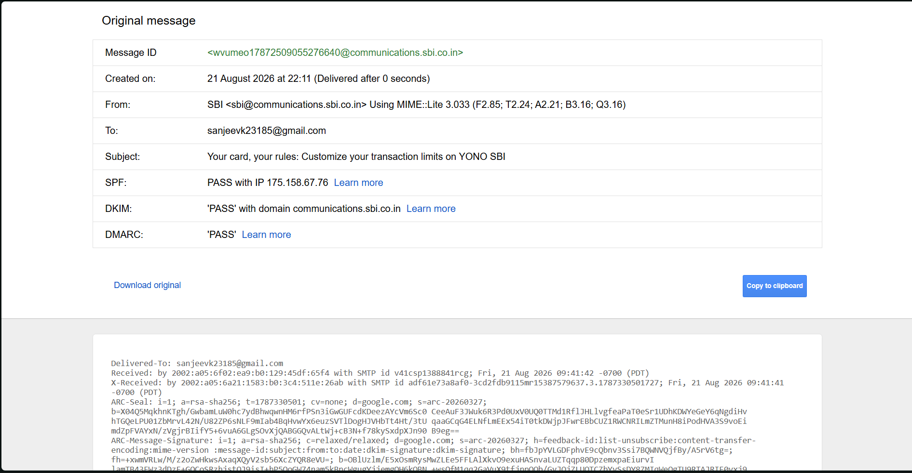
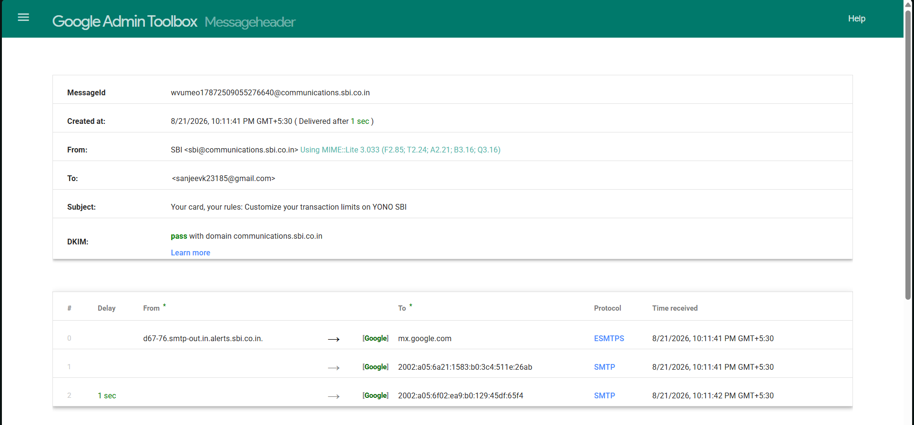

# Ex. No: 04 - Analyze Email Headers and Detect Email Spoofing using MHA

**AIM:**  
To inspect raw email headers, trace server routing hops, and analyze authentication protocols (SPF, DKIM, DMARC) using Mail Header Analyzer (MHA) to identify email spoofing and phishing attempts.

---

### PROCEDURE

1. **Extract Email Header Data:** Open the target email in Gmail, click **More** (three vertical dots), and select **Show original**.
2. **Copy Raw Header Text:** Highlight and copy the full header text, including all metadata fields.
3. **Identify Key Header Metadata Fields:** Locate the `From`, `To`, `Date`, `Subject`, `Return-Path`, `Received`, and `Message-ID` fields.
4. **Analyze Server Hops in 'Received' Lines:** Trace the path of the email starting from the bottom-most `Received:` line up to the top.
5. **Validate Email Authentication Protocols:** Check the status of SPF, DKIM, and DMARC.
6. **Automate Parsing via MHA:** Paste the copied raw header into **Google Admin Toolbox Messageheader**.
7. **Detect Spoofing Anomalies:** Look for domain mismatches, authentication failures, or unexpected routing delays.

---

### DOCUMENTATION OF FINDINGS

**1. Initial Header Extraction (Gmail)**
*   **From:** SBI `<sbi@communications.sbi.co.in>`
*   **To:** `<sanjeevk23185@gmail.com>`
*   **Subject:** Your card, your rules: Customize your transaction limits on YONO SBI
*   **Message-ID:** `wvumeo17872509055276640@communications.sbi.co.in`

**2. MHA Routing and Authentication Analysis (Google Admin Toolbox)**
*   **Authentication Check:** 
    *   **SPF:** PASS 
    *   **DKIM:** PASS (Domain: communications.sbi.co.in)
    *   **DMARC:** PASS
*   **Hop-by-Hop Analysis:**
    *   **Hop 1 (Origin):** From `d67-76.smtp-out.in.alerts.sbi.co.in.` to Google's receiving server (`mx.google.com`) via ESMTPS. 
    *   **Hop 2 & 3 (Internal Routing):** Internal Google SMTP routing to the final inbox.
*   **Delivery Time:** The total transit time from the sender to the inbox was exactly 1 second, indicating no suspicious routing delays or rerouting through unauthorized third-party servers.

**CONCLUSION:**
No anomalies, time discrepancies, or domain mismatches were found. The `From` domain matches the cryptographic `Message-ID` domain. All authentication protocols (SPF, DKIM, DMARC) passed successfully. The email is a legitimate, authorized communication and is **not spoofed**.
