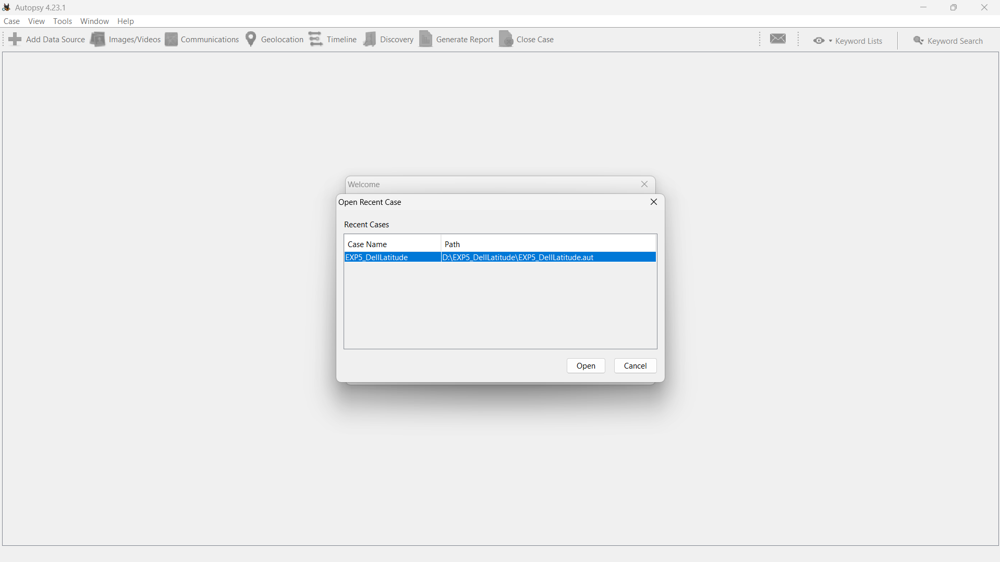
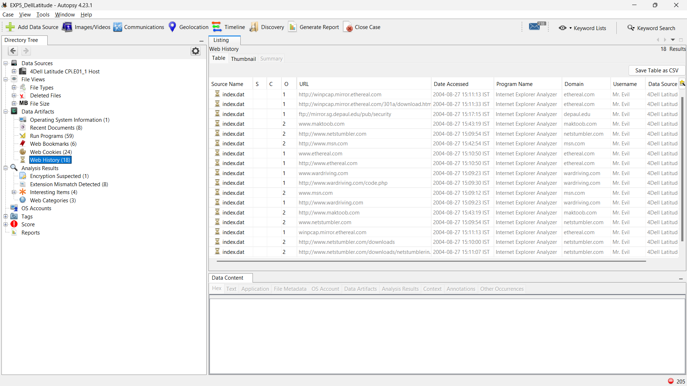
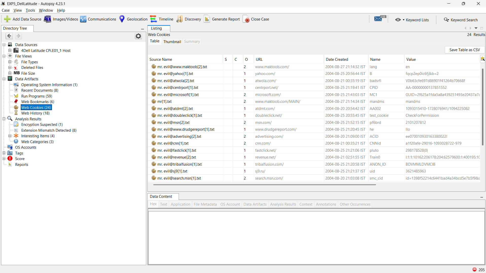
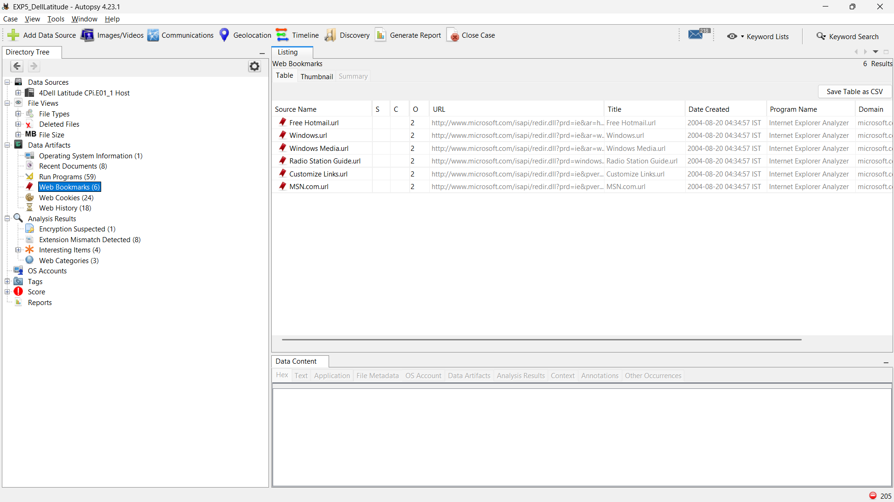
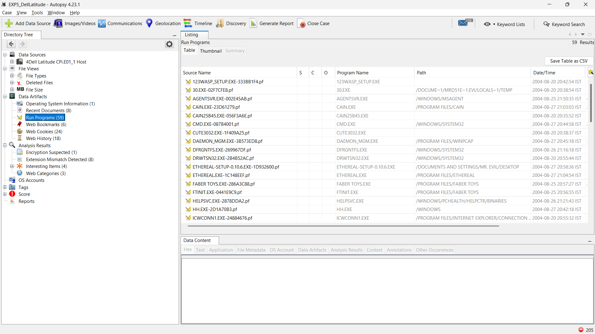
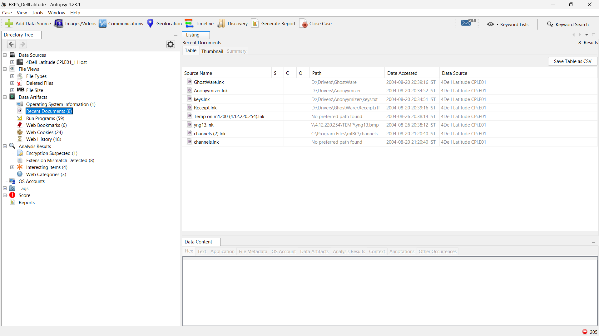
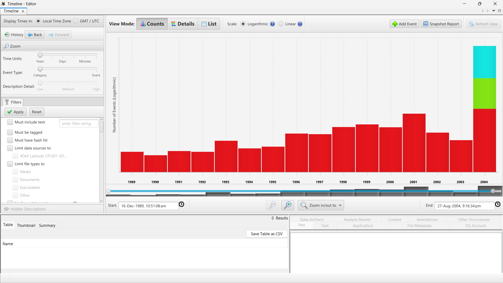

# Experiment 5: Digital Forensics - Autopsy

## Execution Steps

### 1. Autopsy splash screen, "Done loading modules"
Displays the main Autopsy splash screen upon launching the application. All core ingest modules and dependencies have completed loading, preparing the environment for case creation and disk image analysis.

### 2. Welcome / Open Recent Case dialog with "EXP5_DellLatitude"
Demonstrates the initial setup process in the Autopsy Welcome dialog for creating a new forensic case titled `EXP5_DellLatitude`. Case metadata, output directories, and examiner details are configured before attaching the target disk image.

### 3. Web History — 18 results, "Mr. Evil" browsing ethereal.com, wardriving.com, netstumbler.com
Analysis of extracted browser history artifacts reveals 18 web navigation records under the user profile "Mr. Evil". The entries highlight visited URLs related to network auditing and wireless scanning tools, including `ethereal.com`, `wardriving.com`, and `netstumbler.com`.

### 4. Web Cookies — 24 results tied to "mr.evil@..."
Inspection of stored browser cookies yields 24 records associated with the target user identity `mr.evil@...`. These artifacts provide evidence of active web sessions, account tracking data, and domain interactions.

### 5. Web Bookmarks — 6 Microsoft-related bookmarks
Displays saved browser bookmarks retrieved during file system ingestion. A total of 6 default Microsoft-related web bookmarks were indexed from the user's browser settings.

### 6. Run Programs — 59 prefetch (.pf) entries
Forensic examination of Windows Prefetch (`.pf`) artifacts identifies 59 program execution records under the Operating System Artifacts view. These entries document binary execution history, application pathways, run counts, and timestamps.

### 7. Recent Documents — GhostWare, Anonymizer, keys.lnk, Receipt.lnk
Extraction of Windows shortcut (`.lnk`) files and recently accessed documents reveals activity surrounding key files of interest, including `GhostWare`, `Anonymizer`, `keys.lnk`, and `Receipt.lnk`.

### 8. Timeline Editor — event histogram 1989–2004
The Autopsy Timeline tool synthesizes system event data into an interactive event histogram spanning 1989 through 2004. Correlating file modification, access, creation, and entry timestamps (MACB) allows for precise chronological reconstruction of system activity.

