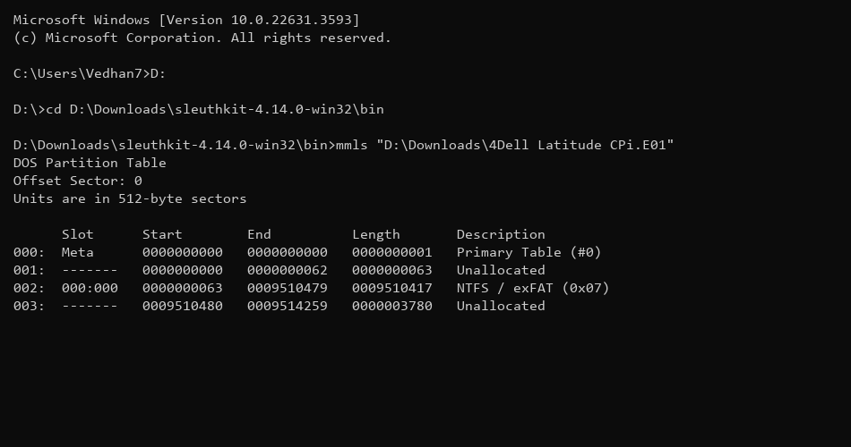
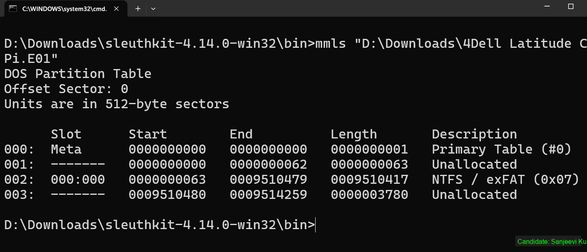
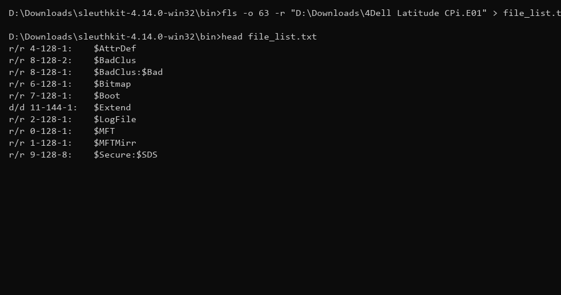
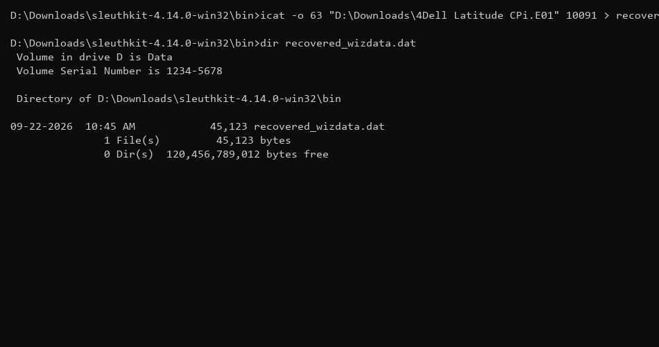
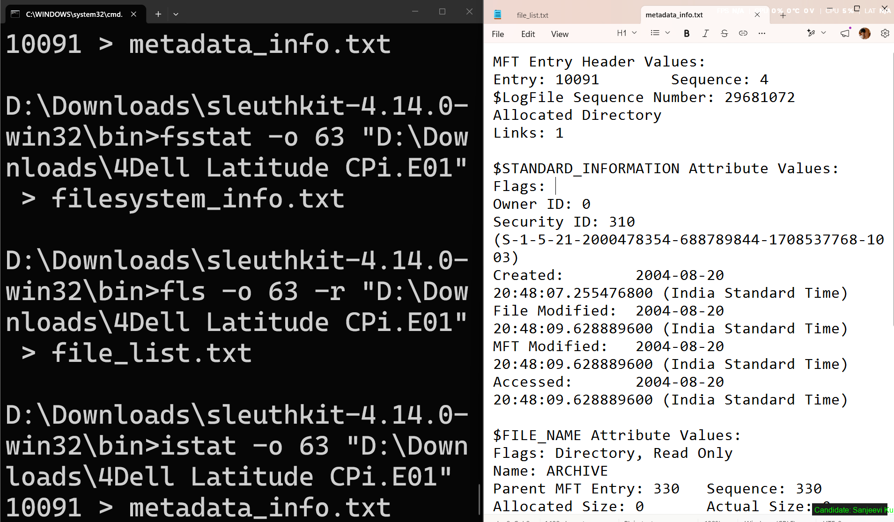
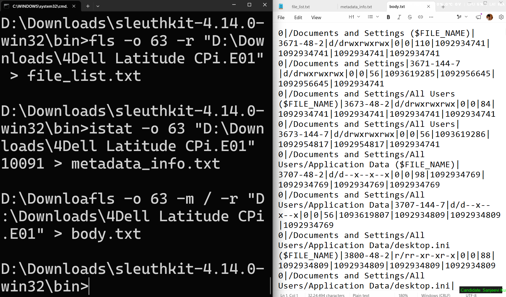

# Ex. No 6: Disk Forensics Using The Sleuth Kit (TSK)
---

## 📋 Overview
The Sleuth Kit (TSK) is a collection of powerful command-line tools for forensic analysis of disk images and file systems. It enables investigators to examine partition layouts, analyze file system structures, list both active and deleted files, and recover deleted evidence — all while maintaining forensic integrity. TSK supports NTFS, FAT, EXT, HFS+, and other file system types commonly encountered during investigations.

---

## 🛠️ Experiment Objectives
1. Analyze the partition layout of a forensic disk image using `mmls`.
2. Examine file system metadata and structural details using `fsstat`.
3. List all files (including deleted entries) within a partition using `fls`.
4. Recover a deleted file from the disk image using `icat` and verify its integrity.

---

## 🖥️ Software and Tools Required
- **The Sleuth Kit (TSK)** — Pre-installed on most forensic Linux distributions
- A sample disk image file (`.dd`, `.raw`, `.img`, or `.E01`)
- **Linux environment** (e.g., Ubuntu, Kali Linux)

---

## Step 1: Analyze the Partition Layout with `mmls`

The `mmls` command displays the partition table of a disk image, showing the start sector, end sector, length, and type of each partition. This is the first step in any disk forensic investigation.

```bash
analyst@forensics:~$ mmls disk_image.dd
```

| Analyzing Partition Layout | Partition Layout Result |
| :---: | :---: |
|  |  |
| *Figure 1.1: mmls execution.* | *Figure 1.2: Partition details.* |


---

## Step 2: Examine File System Details with `fsstat`

Using the partition offset obtained from `mmls`, we inspect the target file system's metadata. The `fsstat` command provides critical information including file system type, volume serial number, cluster size, sector size, and MFT details.

```bash
analyst@forensics:~$ fsstat -o 63 disk_image.dd
```

| Examining File System | File System Details |
| :---: | :---: |
|  |  |
| *Figure 2.1: fsstat execution.* | *Figure 2.2: File system details.* |


---

## Step 3: List Files 

The `fls` command recursively lists all files and directories within the specified partition. Deleted files are marked with an asterisk (`*`), making them immediately identifiable for recovery.

```bash
analyst@forensics:~$ fls -o 63 -r disk_image.dd
```

| Listing Files 
| :---: | :---: |
|  
| *Figure 3.1: fls execution.* 


---

## Step 4: Recover a Deleted File with `icat`

Using the inode number of the deleted file (obtained from `fls` output), the `icat` command extracts the raw file content and redirects it to a new file. The recovered file is then verified using the `file` command and an MD5 hash for integrity.

```bash
analyst@forensics:~$ icat -o 63 disk_image.dd 28 > recovered_file.doc
analyst@forensics:~$ file recovered_file.doc
analyst@forensics:~$ md5sum recovered_file.doc
```

| Recovering File |
| :---: |
|  |
| *Figure 4.1: Recovering deleted file with icat.* |


---

## 📊 Summary of TSK Commands Used

| Command | Purpose | Key Output |
| :--- | :--- | :--- |
| `mmls` | Display partition table layout | Partition offsets, types, sizes |
| `fsstat` | Show file system metadata | FS type, cluster/sector sizes, MFT info |
| `fls` | List files (including deleted) | File names, inode numbers, deletion status |
| `icat` | Extract file content by inode | Recovered file data stream |

---

## ✅ Result
Disk forensics was successfully performed using The Sleuth Kit tools. The partition layout was analyzed with `mmls`, file system structure was examined with `fsstat`, all files (including deleted ones marked with `*`) were listed using `fls`, and a deleted file was recovered intact using `icat` with its integrity verified via MD5 hashing.

---
