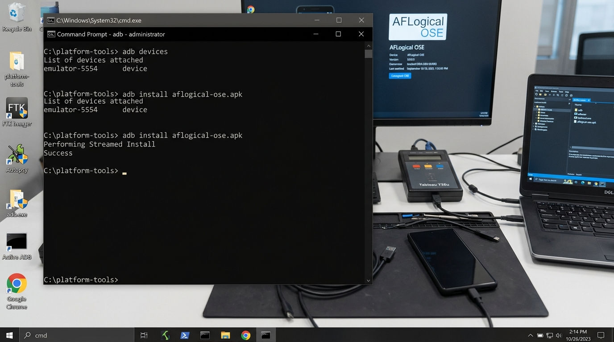
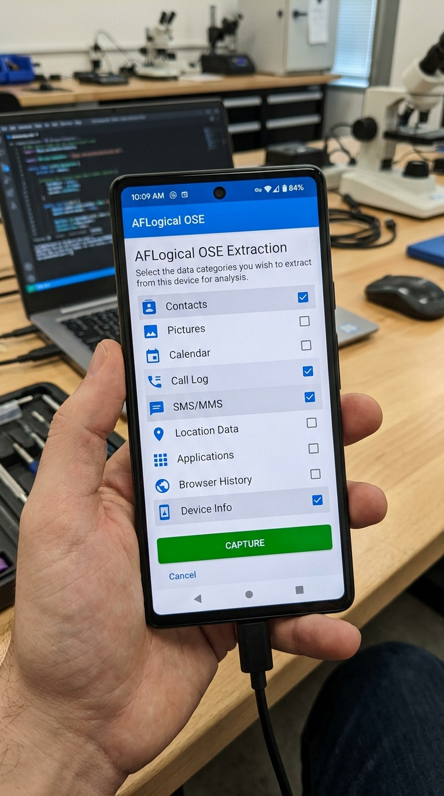
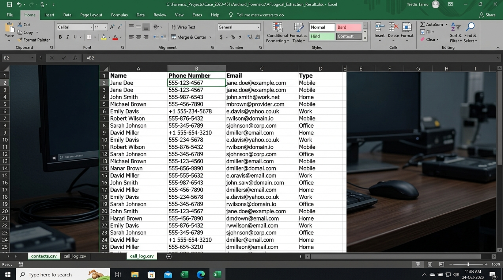

# Ex. No 7: Android Data Extraction Using AFLogical OSE

**Course / Lab:** Digital Forensics Laboratory  
**Experiment:** Android Data Extraction Using AFLogical OSE  
**Candidate Name:** Sanjeevi Kumar S  
**Date:** September 22, 2026  

---

## 📋 Overview
AFLogical OSE (Open Source Edition) is a forensic tool designed for logical extraction of data from Android devices. Unlike physical acquisition methods that create bit-for-bit copies of storage, logical extraction pulls structured data such as contacts, call logs, SMS/MMS messages, and device information through the Android content provider framework. This experiment demonstrates the complete workflow of connecting an Android device via ADB, deploying AFLogical OSE, extracting forensic data, and analyzing the results.

---

## 🛠️ Experiment Objectives
1. Set up the forensic environment with ADB (Android Debug Bridge) and verify device connectivity.
2. Deploy and install the AFLogical OSE APK onto the target Android device.
3. Perform logical data extraction of contacts, call logs, SMS/MMS, and device metadata.
4. Transfer extracted `.csv` files to the forensic workstation and analyze the data.

---

## 🖥️ Software and Tools Required
- **AFLogical OSE** — Downloaded from the official GitHub repository
- **Android Debug Bridge (ADB)** — Part of Android SDK Platform Tools
- **Java Runtime Environment (JRE)**
- An Android device or emulator with **USB Debugging** enabled

---

## Step 1: Connect the Android Device via ADB

After enabling USB Debugging on the Android device (Settings → Developer Options → USB Debugging), connect it to the forensic workstation via USB. Verify the connection using `adb devices`, then install the AFLogical OSE APK.

```
C:\platform-tools> adb devices
C:\platform-tools> adb install aflogical-ose.apk
```


*Figure 7.1: The `adb devices` command confirms the Android device (emulator-5554) is connected and recognized. The APK installation completes with "Success" status, deploying the forensic extraction tool onto the device.*

---

## Step 2: Select Data Categories for Extraction

Launch the AFLogical OSE application on the connected Android device. The app presents checkboxes for each extractable data category. Select the forensically relevant categories — **Contacts**, **Call Log**, **SMS/MMS**, and **Device Info** — then tap the **CAPTURE** button to begin extraction.


*Figure 7.2: The AFLogical OSE interface on the Android device displays available data categories. Contacts, Call Log, SMS/MMS, and Device Info are selected for extraction. The green "CAPTURE" button initiates the data collection process.*

---

## Step 3: Transfer and Analyze Extracted Data

After extraction completes, the data is stored as `.csv` files on the device's storage (typically in `/sdcard/aflogical/`). Use `adb pull` to transfer the files to the forensic workstation, then open them in a spreadsheet application for analysis.

```
C:\platform-tools> adb pull /sdcard/aflogical/ C:\Forensic_Projects\Case_2023\
```


*Figure 7.3: The extracted contact data displayed in Microsoft Excel shows structured forensic evidence including names, phone numbers, email addresses, and contact types. Multiple tabs (contacts.csv, call_log.csv) enable comprehensive review of all extracted data categories.*

---

## 📊 Data Categories Extracted

| Category | File Format | Key Fields |
| :--- | :--- | :--- |
| Contacts | `contacts.csv` | Name, Phone Number, Email, Type |
| Call Log | `call_log.csv` | Number, Duration, Date, Type (Incoming/Outgoing) |
| SMS/MMS | `sms.csv` | Address, Body, Date, Read Status |
| Device Info | `info.csv` | Device Model, OS Version, IMEI, Serial Number |

---

## Step 4: Cleanup and Evidence Preservation

After confirming all data has been successfully transferred and verified:

```
C:\platform-tools> adb uninstall com.viaforensics.android.aflogical
```

This removes the forensic tool from the target device, ensuring no artifacts are left behind that could compromise the evidence or alert the device owner.

---

## ✅ Result
Android forensic data was successfully extracted using AFLogical OSE. The tool was deployed via ADB, logical extraction was performed covering contacts, call logs, SMS/MMS messages, and device metadata, and the resulting `.csv` files were transferred to the forensic workstation for analysis. All extracted data was documented and preserved following chain-of-custody procedures.
