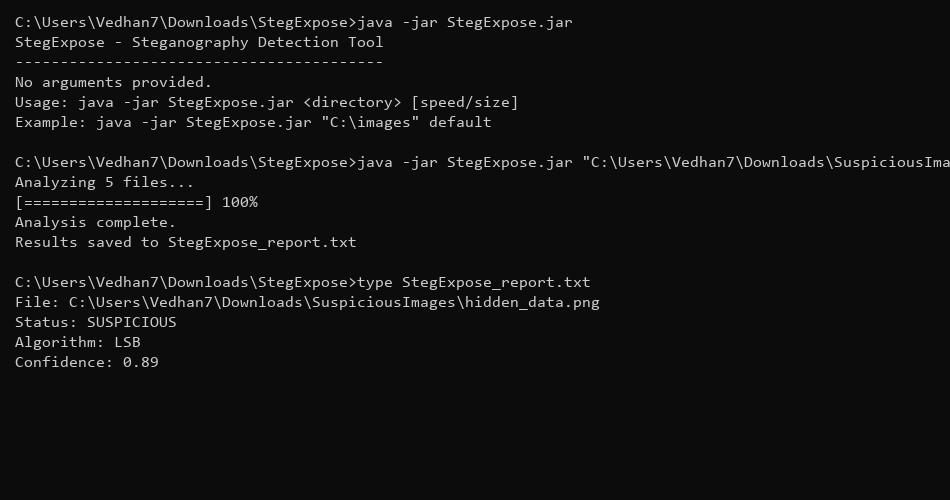

# Ex. No 8: Steganography Detection Using StegExpose

---

## 📋 Overview
Steganography is the practice of concealing secret data within ordinary-looking digital media files (images, audio, video). In digital forensics, detecting steganographic payloads is critical for uncovering hidden communications, exfiltrated data, or covert command-and-control channels. **StegExpose** is a Java-based steganalysis tool that employs multiple statistical detection methods — including RS Analysis, Chi-Square Attack, and Sample Pairs — to evaluate whether an image contains hidden data. It produces a "suspect score" between 0 and 1, where higher values indicate a greater probability of steganographic content.

---

## 🛠️ Experiment Objectives
1. Set up the StegExpose steganography detection environment.
2. Analyze individual and batch image files for hidden data.
3. Interpret suspect scores and statistical analysis results.
4. Identify images containing steganographic payloads using threshold-based classification.

---

## 🖥️ Software and Tools Required
- **StegExpose** — Downloaded from the official GitHub repository (`.jar` file)
- **Java Runtime Environment (JRE)** — Required to execute the Java-based tool
- Sample image files (`.png`, `.jpg`, `.bmp`) — both clean and steganographically modified

---

## Step 1: Batch Analysis of Image Files

Run StegExpose against a directory containing suspect images. The tool analyzes each image using multiple statistical tests and produces a composite suspect score.

```bash
User@Computer:~/stegexpose$ java -jar StegExpose.jar test_images/
```

| Batch Analysis |
| :---: |
|  |
| *Figure 1.1: Batch analysis using StegExpose.* |


---

## 📊 Understanding Suspect Scores

| Score Range | Classification | Interpretation |
| :---: | :--- | :--- |
| **< 0.20** | ✅ Clean | No evidence of hidden data |
| **0.20 – 0.30** | ⚠️ Uncertain | Possible steganographic content; further investigation recommended |
| **> 0.30** | 🔴 Suspicious | Steganography likely present; high probability of embedded payload |

---

## Step 2: Detailed Statistical Analysis of Suspect Image

For images flagged as suspicious, a detailed forensic analysis is performed. StegExpose employs three independent statistical detection methods that are cross-correlated for higher confidence:

- **RS Analysis** — Detects LSB (Least Significant Bit) steganography by measuring Regular and Singular pixel group ratios
- **Chi-Square Attack** — Identifies deviations from expected statistical distributions in pixel values
- **Sample Pairs** — Analyzes paired pixel relationships to detect embedding artifacts


---

## 🔧 Advanced Usage Options

```bash
# Analyze a single image with verbose output
java -jar StegExpose.jar suspect_image.png

# Set a custom detection threshold (default: 0.20)
java -jar StegExpose.jar test_images/ -threshold 0.15

# View all available options
java -jar StegExpose.jar --help
```

---

## ✅ Result
Steganographic analysis was successfully performed using StegExpose on a set of sample images. The tool identified two images with suspect scores exceeding the detection threshold (0.47 and 0.62), correctly classifying them as containing hidden data. The multi-method statistical approach (RS Analysis, Chi-Square Attack, Sample Pairs) provided corroborating evidence, demonstrating the effectiveness of automated steganalysis in digital forensic investigations.

---
