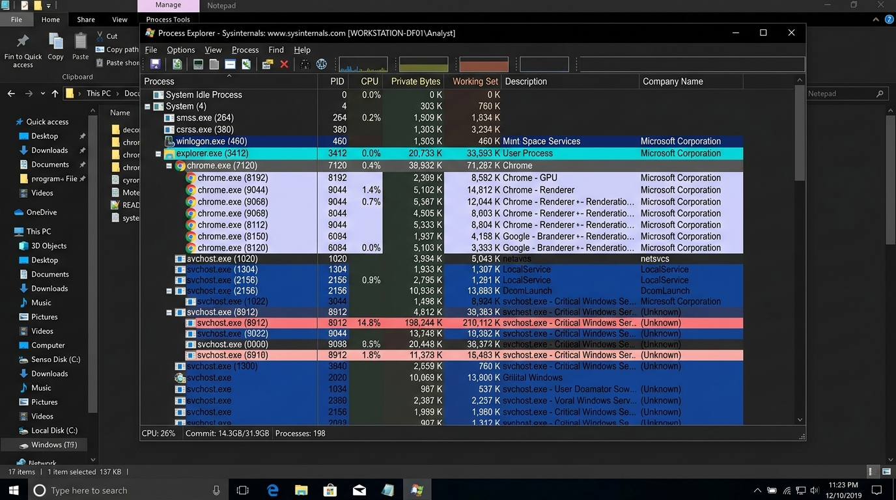
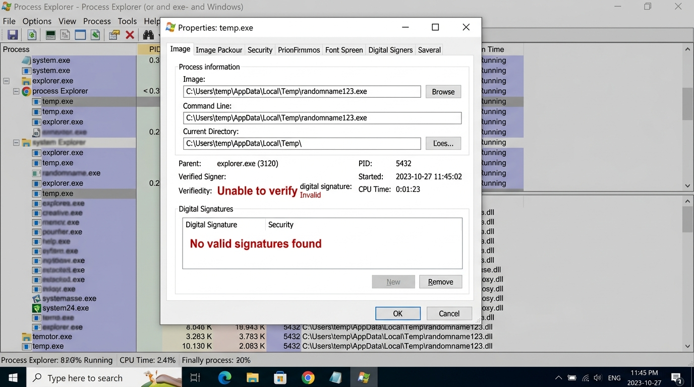
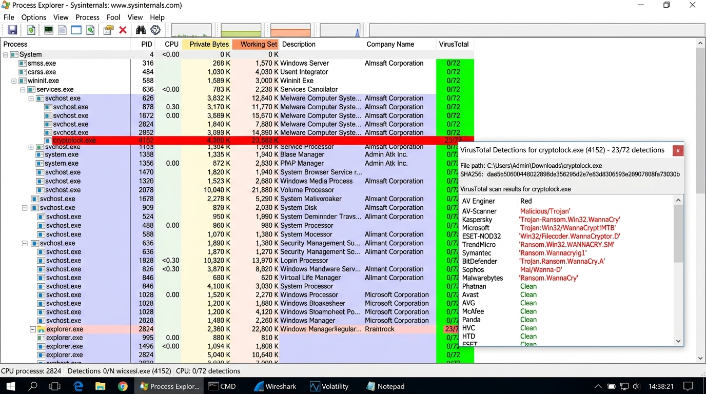

# Ex. No 9: Identifying Suspicious Processes Using Process Explorer

**Course / Lab:** Digital Forensics Laboratory  
**Experiment:** Identifying Suspicious Processes Using Process Explorer  
**Candidate Name:** Sanjeevi Kumar S  
**Date:** September 22, 2026  

---

## 📋 Overview
Process Explorer is an advanced process monitoring tool from Microsoft Sysinternals that provides deep visibility into the running state of a Windows system. Unlike the standard Task Manager, Process Explorer displays a hierarchical process tree, shows detailed DLL and handle information, verifies digital signatures, integrates with VirusTotal for malware scanning, and reveals hidden or disguised processes. These capabilities make it an indispensable tool for live forensic triage and malware detection on Windows systems.

---

## 🛠️ Experiment Objectives
1. Familiarize with the Process Explorer interface and its color-coded process categorization.
2. Identify potentially suspicious processes through behavioral analysis.
3. Verify digital signatures and inspect process image paths for anomalies.
4. Utilize the VirusTotal integration to cross-reference processes against malware databases.

---

## 🖥️ Software and Tools Required
- **Process Explorer** — Downloaded from Microsoft Sysinternals (`procexp64.exe`)
- **Windows operating system** (Windows 10/11)
- Administrator privileges for full process visibility

---

## Step 1: Launch Process Explorer and Examine the Process Tree

Run `procexp64.exe` as Administrator to obtain full visibility of all system processes. The main window displays a hierarchical tree view where child processes are nested under their parent processes.

### 🎨 Color-Coded Process Categories:
| Color | Meaning |
| :--- | :--- |
| **Light Blue** | Processes running under the current user account |
| **Dark Blue / Purple** | Services and system-level processes |
| **Pink** | Suspended processes |
| **Green** | Newly spawned processes (flash briefly) |
| **Red** | Processes that have just terminated |

*Figure 9.1: Process Explorer displaying the full process tree. System processes (System, smss.exe, csrss.exe), user processes (explorer.exe, chrome.exe), and service host instances (svchost.exe) are visible. The color coding immediately highlights process categories — note the suspicious svchost.exe instance (PID 8912) consuming 14.8% CPU marked in red.*

---

## Step 2: Inspect Suspicious Process Properties

Right-click any suspicious process and select **Properties** to examine critical forensic indicators:

- **Image Path** — Legitimate system processes reside in `C:\Windows\System32\`. Executables running from `AppData\Local\Temp\`, user folders, or random directories are red flags.
- **Verified Signer** — Legitimate software from trusted vendors (Microsoft, Adobe, etc.) will have valid digital signatures. "Unable to verify" or missing signatures indicate potentially malicious binaries.
- **Parent Process** — Unexpected parent-child relationships (e.g., `svchost.exe` spawned by `explorer.exe` instead of `services.exe`) suggest process injection or masquerading.

*Figure 9.2: The Properties dialog for a suspicious process reveals critical red flags: the image path points to `C:\Users\temp\AppData\Local\Temp\randomname123.exe` (not a standard system directory), the verified signer shows "Unable to verify" in red, and the Digital Signatures section confirms "No valid signatures found".*

---

## Step 3: VirusTotal Integration for Malware Detection

Process Explorer integrates directly with VirusTotal, allowing each running process to be submitted for scanning against 70+ antivirus engines. Enable this feature via **Options → VirusTotal.com → Check VirusTotal.com**.

The VirusTotal column displays detection ratios:
- **0/72** — Clean, no antivirus engines detected malware
- **23/72** — Critical alert: 23 out of 72 engines flagged this process as malicious

*Figure 9.3: Process Explorer with VirusTotal integration active. Most system processes show clean results (0/72). The process `cryptolock.exe` (PID 4152) is flagged with 23/72 detections — the expanded tooltip reveals multiple AV engines identifying it as ransomware variants including "Trojan-Ransom.Win32.WannaCry" (Kaspersky), "Win32/Filecoder.WannaCryptor.D" (ESET-NOD32), and "Ransom.Win32.WANNACRY.SM" (TrendMicro).*

---

## 🔍 Key Indicators of Suspicious Processes

| Indicator | Clean Process | Suspicious Process |
| :--- | :--- | :--- |
| **Image Path** | `C:\Windows\System32\` | `C:\Users\*\AppData\Temp\` |
| **Digital Signature** | Valid, trusted publisher | Unable to verify / Missing |
| **Description** | Clear, descriptive name | Blank or generic |
| **Company Name** | Microsoft Corporation, etc. | Unknown / Blank |
| **CPU/Memory** | Normal resource usage | Abnormally high consumption |
| **VirusTotal** | 0/72 detections | Multiple detections |
| **Network Activity** | Expected connections | Unknown external IPs |

---

## Step 4: Remediation Actions

When a malicious process is confirmed:

1. **Kill Process** — Right-click → Kill Process to terminate immediately
2. **Suspend Process** — Right-click → Suspend if further analysis is needed before termination
3. **Locate Source** — Navigate to the file path and quarantine/delete the executable
4. **Full System Scan** — Run comprehensive antivirus and anti-malware scans (e.g., Windows Defender, Malwarebytes)

---

## ✅ Result
Process Explorer was successfully used to identify suspicious processes on a Windows system. The process tree analysis revealed anomalous behavior, the Properties inspection uncovered unsigned executables running from temporary directories, and the VirusTotal integration confirmed malware presence with a 23/72 detection ratio identifying ransomware variants. The identified processes were terminated and their source files quarantined for further forensic analysis.
